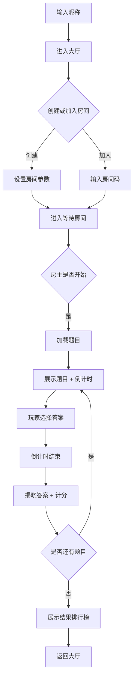

## 1. 产品概述

实时知识竞赛对战平台，支持多人在线实时答题对战，通过WebSocket实现毫秒级同步，融合速度、知识与策略的竞技体验。

- 核心价值：提供紧张刺激的实时知识对战体验，支持题库管理、房间系统、实时对战、积分排行、观战弹幕等完整功能
- 目标用户：知识竞赛爱好者、线上团建活动组织者、教育培训机构

## 2. 核心功能

### 2.1 用户角色

| 角色 | 登录方式 | 核心权限 |
|------|----------|----------|
| 管理员 | 密码登录 | 题库管理（增删改查、批量导入）、查看统计数据 |
| 普通用户 | 昵称输入 | 创建/加入房间、实时对战、查看历史记录、个人统计、观战弹幕 |
| 观众 | 昵称输入 | 观看实时对战、发送弹幕、查看回放 |

### 2.2 功能模块

1. **题库管理**：题目CRUD、批量JSON导入、使用频次/正确率统计、分类与难度管理
2. **房间系统**：创建房间（2-8人）、房间码加入、游戏设置、房主权限、等待大厅
3. **实时对战**：WebSocket同步、倒计时、答题状态、答案揭晓、实时计分
4. **积分系统**：基础分+速度奖励+连对加成+首位奖励、排行榜
5. **对战记录**：历史对战列表、个人统计（胜率/擅长分类/平均用时/最长连对）、周/月/总排行榜
6. **观战模式**：实时观战、弹幕评论、对战回放

### 2.3 页面详情

| 页面名称 | 模块名称 | 功能描述 |
|-----------|-------------|---------------------|
| 首页 | 导航栏、快速入口、排行榜预览 | 输入昵称快速进入，展示热门房间和排行榜 |
| 题库管理 | 题目列表、新增/编辑表单、批量导入、统计图表 | 管理员管理题目，查看使用统计 |
| 房间大厅 | 房间列表、创建房间弹窗、加入房间弹窗 | 浏览公开房间，创建或加入房间 |
| 房间等待 | 玩家列表、游戏设置、开始按钮、聊天区 | 等待玩家加入，房主可踢人和开始 |
| 对战页面 | 题目展示、倒计时、选项按钮、玩家状态、实时得分 | 核心对战界面，实时同步所有状态 |
| 结果页面 | 排行榜、得分明细、每题详情 | 展示最终排名和各项得分明细 |
| 观战页面 | 实时对战画面、弹幕区、选手状态 | 观众视角观看对战 |
| 个人中心 | 历史记录、个人统计、对战回放 | 查看个人数据和历史对战 |
| 排行榜 | 周榜/月榜/总榜切换、分类筛选 | 全平台排名展示 |

## 3. 核心流程

### 3.1 对战主流程

用户输入昵称 → 进入大厅 → 创建/加入房间 → 等待玩家 → 房主开始游戏 → 题目展示与倒计时 → 玩家选择答案 → 揭晓答案与计分 → 循环至题目结束 → 展示结果排行榜

### 3.2 观战流程

选择进行中的房间 → 进入观战页面 → 实时同步对战画面 → 发送弹幕 → 游戏结束 → 可查看回放

## 4. 用户界面设计

### 4.1 设计风格

- **主色调**：深空蓝 (#0F172A) 作为背景主色，霓虹紫 (#8B5CF6) 作为主要强调色，电光青 (#22D3EE) 作为次要强调色
- **辅助色**：成功绿 (#10B981)、警告橙 (#F59E0B)、错误红 (#EF4444)
- **设计风格**：赛博朋克/科技感风格，深色主题，渐变背景，霓虹发光效果
- **字体**：标题使用 Space Grotesk（粗体），正文使用 Inter（常规），数字使用 JetBrains Mono（等宽）
- **按钮风格**：圆角8px，渐变填充，hover时发光效果，按下时轻微凹陷
- **布局风格**：卡片式布局，毛玻璃效果（backdrop-filter），网格对齐
- **图标风格**：线性图标（lucide-react），统一16px/20px/24px尺寸

### 4.2 页面设计概述

| 页面名称 | 模块名称 | UI元素 |
|-----------|-------------|-------------|
| 首页 | 导航栏、Hero区、快速入口 | 渐变背景、霓虹标题动画、发光按钮、悬浮卡片效果 |
| 对战页面 | 题目区、选项区、玩家状态栏、倒计时 | 巨大倒计时数字动画、选项悬浮效果、答题状态实时闪烁、得分数字滚动动画 |
| 房间等待 | 玩家卡片、设置面板、房间码 | 玩家头像呼吸灯效果、房间码复制按钮、准备状态指示器 |
| 结果页面 | 排行榜、得分明细 | 排名动画（从低到高依次出现）、金银铜奖牌、柱状图对比 |
| 观战页面 | 对战画面、弹幕层、选手面板 | 半透明弹幕滚动、答题进度条、实时状态徽章 |

### 4.3 响应式

- Desktop-first 设计，主内容区最大宽度1440px
- 断点：sm(640px)、md(768px)、lg(1024px)、xl(1280px)
- 移动端优化：触控目标≥44px，关键按钮固定在底部，横屏模式适配

### 4.4 动画与动效

- 页面加载：元素从下往上渐入，stagger延迟100ms
- 倒计时：数字缩放脉冲动画，最后3秒变红并加速
- 答题正确：选项变绿+缩放+粒子爆发效果
- 答题错误：选项变红+轻微抖动
- 得分变化：数字从旧值滚动到新值，带+号前缀
- 连对提示：顶部弹出"连对x3！"横幅动画
- 弹幕：从右向左平滑滚动，支持彩色弹幕

## 5. 非功能性需求

| 需求类型 | 具体要求 |
|---------|---------|
| 性能 | WebSocket延迟<100ms，题目加载<500ms，支持500+并发在线 |
| 可用性 | 前端3384端口，后端8384端口，HTTP与WebSocket共用端口 |
| 数据 | 预置100道各分类题目，支持SQLite本地存储 |
| 安全 | 房间码6位随机，踢人权限校验，防重复提交 |
