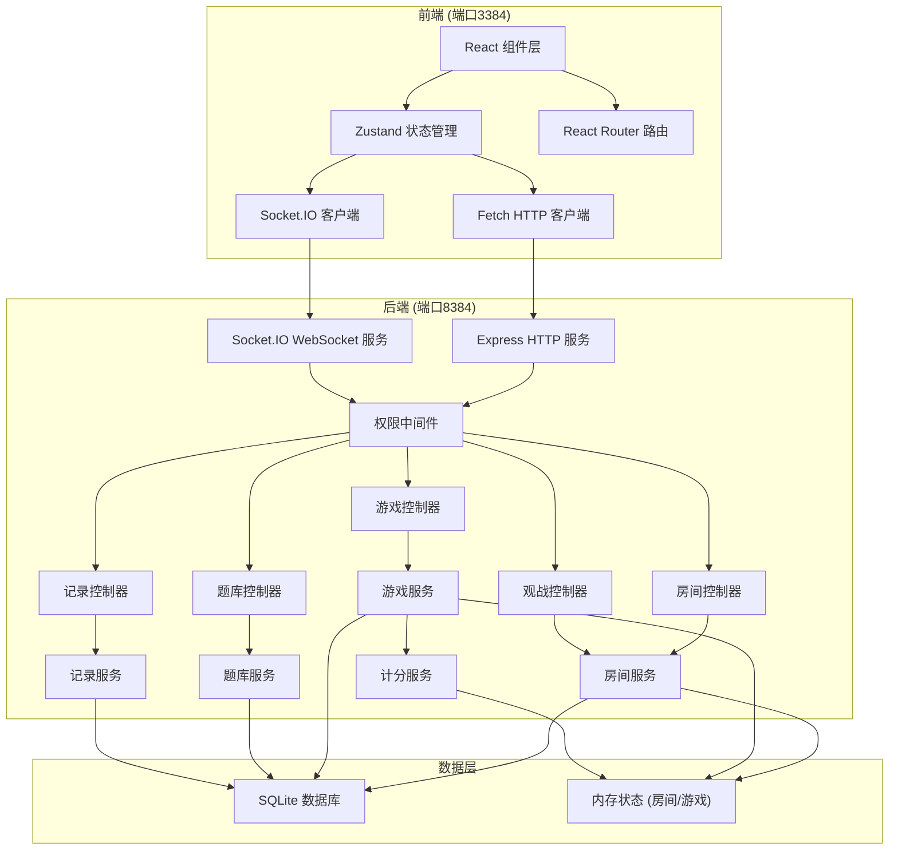
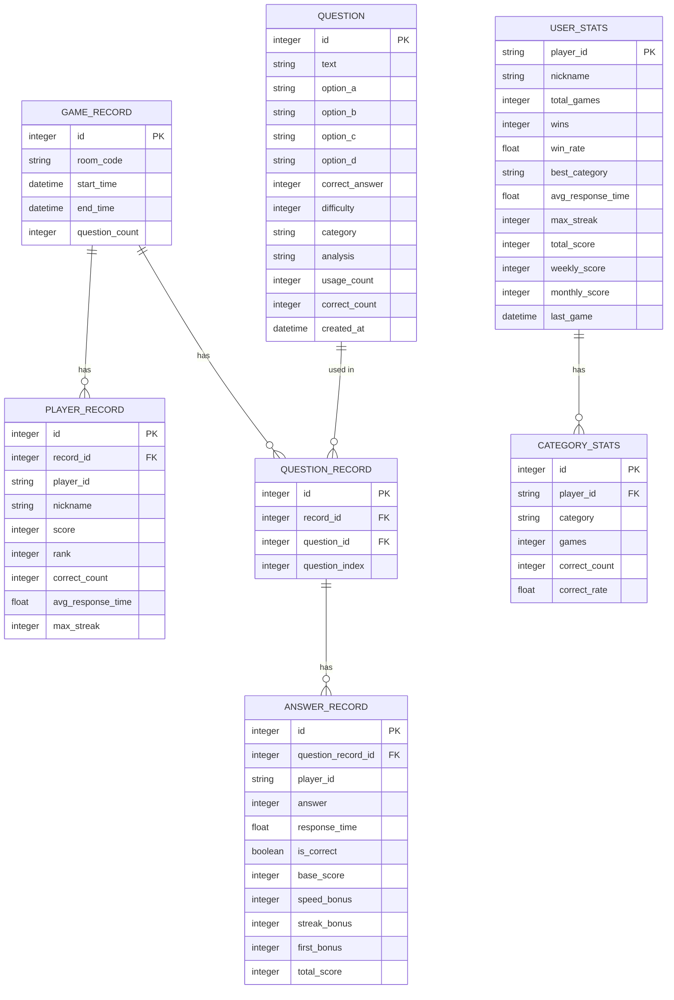
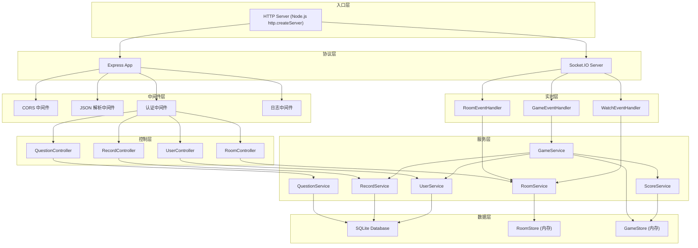

## 1. 架构设计



## 2. 技术描述

| 层级 | 技术选型 | 版本 | 说明 |
|------|---------|------|-----|
| 前端框架 | React | 18.x | 用户界面库 |
| 前端语言 | TypeScript | 5.x | 类型安全 |
| 构建工具 | Vite | 5.x | 快速构建与热更新 |
| 前端路由 | react-router-dom | 6.x | 单页路由 |
| 状态管理 | zustand | 4.x | 轻量状态管理 |
| UI样式 | tailwindcss | 3.x | 原子化CSS |
| 图标库 | lucide-react | 0.x | 线性图标 |
| WebSocket | socket.io-client | 4.x | 实时通信客户端 |
| HTTP请求 | fetch API | - | 原生HTTP客户端 |
| 后端框架 | Express | 4.x | Node.js Web框架 |
| 后端语言 | TypeScript | 5.x | 类型安全 |
| WebSocket服务 | socket.io | 4.x | 实时通信服务端 |
| 数据库 | SQLite (better-sqlite3) | 11.x | 本地文件数据库 |
| 运行时 | Node.js | 20.x | LTS版本 |
| 代码规范 | ESLint + Prettier | - | 代码质量 |

## 3. 目录结构

```
hwj-00384/
├── .trae/documents/         # 文档目录
├── src/                     # 前端源码
│   ├── components/          # 通用组件
│   │   ├── layout/          # 布局组件
│   │   ├── game/            # 游戏相关组件
│   │   └── ui/              # 基础UI组件
│   ├── pages/               # 页面组件
│   ├── hooks/               # 自定义Hooks
│   ├── stores/              # Zustand状态
│   ├── utils/               # 工具函数
│   ├── types/               # TypeScript类型
│   ├── api/                 # API封装
│   ├── socket/              # Socket.IO封装
│   ├── App.tsx              # 根组件
│   ├── main.tsx             # 入口文件
│   └── index.css            # 全局样式
├── api/                     # 后端源码
│   ├── src/
│   │   ├── controllers/     # 控制器层
│   │   ├── services/        # 服务层
│   │   ├── models/          # 数据模型
│   │   ├── middleware/      # 中间件
│   │   ├── db/              # 数据库
│   │   ├── types/           # 类型定义
│   │   ├── utils/           # 工具函数
│   │   └── index.ts         # 入口文件
│   └── data/                # 预置数据
├── shared/                  # 前后端共享类型
├── vite.config.ts           # Vite配置
├── tailwind.config.js       # Tailwind配置
├── tsconfig.json            # TS配置
├── package.json             # 项目依赖
└── README.md
```

## 4. 前端路由定义

| 路由路径 | 页面名称 | 说明 |
|---------|---------|-----|
| `/` | 首页 | 输入昵称、快速入口 |
| `/lobby` | 房间大厅 | 房间列表、创建/加入房间 |
| `/room/:code` | 房间等待页 | 等待玩家、游戏设置 |
| `/game/:code` | 对战页面 | 实时答题对战 |
| `/result/:code` | 结果页面 | 排行榜、得分明细 |
| `/watch/:code` | 观战页面 | 实时观战、弹幕 |
| `/questions` | 题库管理 | 管理员题库管理 |
| `/profile` | 个人中心 | 历史记录、个人统计 |
| `/rankings` | 排行榜 | 周/月/总榜 |
| `/replay/:recordId` | 回放页面 | 对战回放 |

## 5. API 定义

### 5.1 HTTP API

```typescript
// ========== 题库相关 ==========
interface Question {
  id: number;
  text: string;
  options: string[]; // 长度4
  correctAnswer: number; // 0-3
  difficulty: number; // 1-5
  category: 'technology' | 'history' | 'geography' | 'literature' | 'sports' | 'entertainment';
  analysis: string;
  usageCount: number;
  correctCount: number;
  createdAt: string;
}

// GET /api/questions - 获取题目列表
interface GetQuestionsQuery {
  page?: number;
  pageSize?: number;
  category?: string;
  difficulty?: number;
  keyword?: string;
}
interface GetQuestionsResponse {
  list: Question[];
  total: number;
}

// POST /api/questions - 创建题目
interface CreateQuestionRequest {
  text: string;
  options: string[];
  correctAnswer: number;
  difficulty: number;
  category: string;
  analysis: string;
}

// PUT /api/questions/:id - 更新题目
interface UpdateQuestionRequest extends CreateQuestionRequest {}

// DELETE /api/questions/:id - 删除题目
interface DeleteQuestionResponse { success: boolean }

// POST /api/questions/batch - 批量导入
interface BatchImportRequest {
  questions: CreateQuestionRequest[];
}
interface BatchImportResponse {
  success: number;
  failed: number;
  errors: string[];
}

// GET /api/questions/stats - 题目统计
interface QuestionStatsResponse {
  total: number;
  byCategory: Record<string, number>;
  byDifficulty: Record<number, number>;
  totalUsage: number;
  averageCorrectRate: number;
}

// ========== 房间相关 ==========
interface Room {
  code: string;
  ownerId: string;
  players: Player[];
  settings: RoomSettings;
  status: 'waiting' | 'playing' | 'finished';
  createdAt: string;
  hasPassword: boolean;
}

interface Player {
  id: string;
  nickname: string;
  avatar: string;
  score: number;
  streak: number;
  isReady: boolean;
  isOnline: boolean;
}

interface RoomSettings {
  maxPlayers: number; // 2-8
  questionCount: 5 | 10 | 20;
  timeLimit: 5 | 10 | 15;
  categories: string[];
  minDifficulty: number;
  maxDifficulty: number;
  password?: string;
}

// GET /api/rooms - 获取房间列表
interface GetRoomsResponse { rooms: Room[] }

// POST /api/rooms - 创建房间
interface CreateRoomRequest {
  nickname: string;
  settings: RoomSettings;
}
interface CreateRoomResponse {
  code: string;
  playerId: string;
}

// POST /api/rooms/:code/join - 加入房间
interface JoinRoomRequest {
  nickname: string;
  password?: string;
}
interface JoinRoomResponse {
  playerId: string;
  room: Room;
}

// POST /api/rooms/:code/leave - 离开房间
interface LeaveRoomResponse { success: boolean }

// PUT /api/rooms/:code/settings - 更新房间设置
interface UpdateSettingsRequest extends RoomSettings {}

// POST /api/rooms/:code/kick - 踢人
interface KickRequest { playerId: string }

// POST /api/rooms/:code/start - 开始游戏
interface StartGameResponse { success: boolean }

// ========== 对战记录相关 ==========
interface GameRecord {
  id: number;
  roomCode: string;
  startTime: string;
  endTime: string;
  players: PlayerResult[];
  questionCount: number;
}

interface PlayerResult {
  playerId: string;
  nickname: string;
  score: number;
  rank: number;
  correctCount: number;
  avgResponseTime: number;
  maxStreak: number;
  scoreDetails: ScoreDetail[];
}

interface ScoreDetail {
  questionId: number;
  isCorrect: boolean;
  responseTime: number;
  baseScore: number;
  speedBonus: number;
  streakBonus: number;
  firstBonus: number;
  totalScore: number;
}

// GET /api/records - 获取对战记录列表
interface GetRecordsQuery {
  playerId?: string;
  page?: number;
  pageSize?: number;
}
interface GetRecordsResponse {
  list: GameRecord[];
  total: number;
}

// GET /api/records/:id - 获取对战记录详情
interface GetRecordResponse extends GameRecord {
  questions: QuestionResult[];
  playerAnswers: Record<string, number[]>;
}

interface QuestionResult {
  question: Question;
  playerAnswers: Record<string, { answer: number; responseTime: number }>;
}

// GET /api/records/:id/replay - 获取回放数据
interface GetReplayResponse {
  timeline: ReplayEvent[];
}

interface ReplayEvent {
  timestamp: number;
  type: 'question' | 'answer' | 'reveal' | 'score';
  data: any;
}

// ========== 用户统计相关 ==========
interface UserStats {
  playerId: string;
  nickname: string;
  totalGames: number;
  wins: number;
  winRate: number;
  bestCategory: string;
  avgResponseTime: number;
  maxStreak: number;
  totalScore: number;
  rank: {
    weekly: number;
    monthly: number;
    allTime: number;
  };
}

// GET /api/users/:id/stats - 获取用户统计
interface GetUserStatsResponse extends UserStats {}

// GET /api/rankings - 获取排行榜
interface GetRankingsQuery {
  type: 'weekly' | 'monthly' | 'allTime';
  category?: string;
  page?: number;
  pageSize?: number;
}
interface GetRankingsResponse {
  list: RankingItem[];
  total: number;
}

interface RankingItem {
  rank: number;
  playerId: string;
  nickname: string;
  score: number;
  winRate: number;
  games: number;
}
```

### 5.2 WebSocket 事件

```typescript
// 客户端发送事件
interface ClientToServerEvents {
  'room:join': (data: { roomCode: string; playerId: string }) => void;
  'room:leave': (data: { roomCode: string; playerId: string }) => void;
  'room:playerUpdate': (data: { roomCode: string; player: Partial<Player> }) => void;
  
  'game:answer': (data: {
    roomCode: string;
    playerId: string;
    questionIndex: number;
    answer: number;
    responseTime: number;
  }) => void;
  
  'watch:join': (data: { roomCode: string; viewerId: string; nickname: string }) => void;
  'watch:leave': (data: { roomCode: string; viewerId: string }) => void;
  'watch:danmu': (data: {
    roomCode: string;
    viewerId: string;
    nickname: string;
    content: string;
    color?: string;
  }) => void;
}

// 服务端发送事件
interface ServerToClientEvents {
  'room:playerJoined': (data: { player: Player }) => void;
  'room:playerLeft': (data: { playerId: string }) => void;
  'room:playerKicked': (data: { playerId: string; reason: string }) => void;
  'room:settingsUpdated': (data: { settings: RoomSettings }) => void;
  'room:gameStarting': (data: { countdown: number }) => void;
  
  'game:started': (data: {
    totalQuestions: number;
    timeLimit: number;
  }) => void;
  'game:question': (data: {
    question: Question;
    questionIndex: number;
    startTime: number;
    endTime: number;
  }) => void;
  'game:playerAnswered': (data: {
    playerId: string;
    questionIndex: number;
    responseTime: number;
  }) => void;
  'game:reveal': (data: {
    questionIndex: number;
    correctAnswer: number;
    analysis: string;
    scores: Record<string, ScoreDetail>;
    standings: Player[];
  }) => void;
  'game:finished': (data: {
    recordId: number;
    finalStandings: PlayerResult[];
  }) => void;
  
  'watch:viewerJoined': (data: { viewerId: string; nickname: string; count: number }) => void;
  'watch:viewerLeft': (data: { viewerId: string; count: number }) => void;
  'watch:danmu': (data: {
    id: string;
    nickname: string;
    content: string;
    color: string;
    timestamp: number;
  }) => void;
  'watch:gameState': (data: {
    phase: 'waiting' | 'question' | 'reveal' | 'finished';
    question?: Question;
    questionIndex?: number;
    remainingTime?: number;
    playerStates: Record<string, { answered: boolean; score: number; streak: number }>;
  }) => void;
}
```

## 6. 数据模型

### 6.1 ER 图



### 6.2 DDL 语句

```sql
-- 题目表
CREATE TABLE IF NOT EXISTS questions (
  id INTEGER PRIMARY KEY AUTOINCREMENT,
  text TEXT NOT NULL,
  option_a TEXT NOT NULL,
  option_b TEXT NOT NULL,
  option_c TEXT NOT NULL,
  option_d TEXT NOT NULL,
  correct_answer INTEGER NOT NULL CHECK (correct_answer BETWEEN 0 AND 3),
  difficulty INTEGER NOT NULL CHECK (difficulty BETWEEN 1 AND 5),
  category TEXT NOT NULL CHECK (category IN ('technology', 'history', 'geography', 'literature', 'sports', 'entertainment')),
  analysis TEXT NOT NULL DEFAULT '',
  usage_count INTEGER NOT NULL DEFAULT 0,
  correct_count INTEGER NOT NULL DEFAULT 0,
  created_at DATETIME NOT NULL DEFAULT CURRENT_TIMESTAMP
);

-- 游戏记录表
CREATE TABLE IF NOT EXISTS game_records (
  id INTEGER PRIMARY KEY AUTOINCREMENT,
  room_code TEXT NOT NULL,
  start_time DATETIME NOT NULL,
  end_time DATETIME NOT NULL,
  question_count INTEGER NOT NULL
);

-- 玩家记录表
CREATE TABLE IF NOT EXISTS player_records (
  id INTEGER PRIMARY KEY AUTOINCREMENT,
  record_id INTEGER NOT NULL,
  player_id TEXT NOT NULL,
  nickname TEXT NOT NULL,
  score INTEGER NOT NULL DEFAULT 0,
  rank INTEGER NOT NULL,
  correct_count INTEGER NOT NULL DEFAULT 0,
  avg_response_time REAL NOT NULL DEFAULT 0,
  max_streak INTEGER NOT NULL DEFAULT 0,
  FOREIGN KEY (record_id) REFERENCES game_records(id) ON DELETE CASCADE
);

-- 题目记录表
CREATE TABLE IF NOT EXISTS question_records (
  id INTEGER PRIMARY KEY AUTOINCREMENT,
  record_id INTEGER NOT NULL,
  question_id INTEGER NOT NULL,
  question_index INTEGER NOT NULL,
  FOREIGN KEY (record_id) REFERENCES game_records(id) ON DELETE CASCADE,
  FOREIGN KEY (question_id) REFERENCES questions(id)
);

-- 答题记录表
CREATE TABLE IF NOT EXISTS answer_records (
  id INTEGER PRIMARY KEY AUTOINCREMENT,
  question_record_id INTEGER NOT NULL,
  player_id TEXT NOT NULL,
  answer INTEGER NOT NULL,
  response_time REAL NOT NULL,
  is_correct INTEGER NOT NULL DEFAULT 0,
  base_score INTEGER NOT NULL DEFAULT 0,
  speed_bonus INTEGER NOT NULL DEFAULT 0,
  streak_bonus INTEGER NOT NULL DEFAULT 0,
  first_bonus INTEGER NOT NULL DEFAULT 0,
  total_score INTEGER NOT NULL DEFAULT 0,
  FOREIGN KEY (question_record_id) REFERENCES question_records(id) ON DELETE CASCADE
);

-- 用户统计表
CREATE TABLE IF NOT EXISTS user_stats (
  player_id TEXT PRIMARY KEY,
  nickname TEXT NOT NULL,
  total_games INTEGER NOT NULL DEFAULT 0,
  wins INTEGER NOT NULL DEFAULT 0,
  win_rate REAL NOT NULL DEFAULT 0,
  best_category TEXT,
  avg_response_time REAL NOT NULL DEFAULT 0,
  max_streak INTEGER NOT NULL DEFAULT 0,
  total_score INTEGER NOT NULL DEFAULT 0,
  weekly_score INTEGER NOT NULL DEFAULT 0,
  monthly_score INTEGER NOT NULL DEFAULT 0,
  last_game DATETIME
);

-- 分类统计表
CREATE TABLE IF NOT EXISTS category_stats (
  id INTEGER PRIMARY KEY AUTOINCREMENT,
  player_id TEXT NOT NULL,
  category TEXT NOT NULL,
  games INTEGER NOT NULL DEFAULT 0,
  correct_count INTEGER NOT NULL DEFAULT 0,
  correct_rate REAL NOT NULL DEFAULT 0,
  FOREIGN KEY (player_id) REFERENCES user_stats(player_id) ON DELETE CASCADE,
  UNIQUE(player_id, category)
);

-- 索引
CREATE INDEX IF NOT EXISTS idx_questions_category ON questions(category);
CREATE INDEX IF NOT EXISTS idx_questions_difficulty ON questions(difficulty);
CREATE INDEX IF NOT EXISTS idx_game_records_room ON game_records(room_code);
CREATE INDEX IF NOT EXISTS idx_player_records_player ON player_records(player_id);
CREATE INDEX IF NOT EXISTS idx_user_stats_weekly ON user_stats(weekly_score DESC);
CREATE INDEX IF NOT EXISTS idx_user_stats_monthly ON user_stats(monthly_score DESC);
CREATE INDEX IF NOT EXISTS idx_user_stats_total ON user_stats(total_score DESC);
```

## 7. 计分规则

```typescript
// 积分计算规则
function calculateScore(
  isCorrect: boolean,
  responseTime: number,
  timeLimit: number,
  streak: number,
  isFirstCorrect: boolean
): ScoreDetail {
  if (!isCorrect) {
    return {
      baseScore: 0,
      speedBonus: 0,
      streakBonus: 0,
      firstBonus: 0,
      totalScore: 0,
    };
  }

  // 基础分
  const baseScore = 10;

  // 速度奖励: 剩余时间比例 * 10，最多10分
  // responseTime越小，奖励越高
  const speedBonus = Math.round(((timeLimit - responseTime) / timeLimit) * 10);

  // 连对加成: 连对3题以上，每题额外+3
  const streakBonus = streak >= 3 ? 3 : 0;

  // 首个答对额外+5
  const firstBonus = isFirstCorrect ? 5 : 0;

  return {
    baseScore,
    speedBonus,
    streakBonus,
    firstBonus,
    totalScore: baseScore + speedBonus + streakBonus + firstBonus,
  };
}
```

## 8. 端口配置

| 服务 | 端口 | 协议 | 说明 |
|------|------|------|-----|
| 前端开发服务器 | 3384 | HTTP | Vite dev server |
| 后端服务 | 8384 | HTTP + WebSocket | Express + Socket.IO 共用端口 |

## 9. 服务器架构


